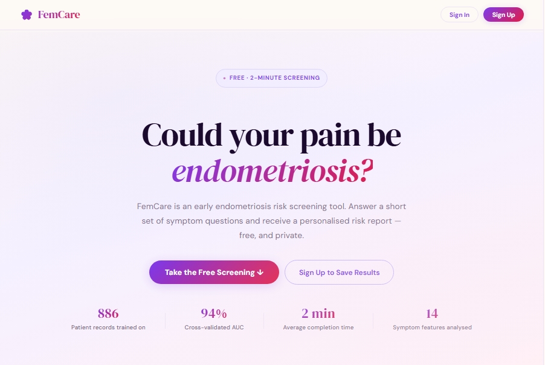

# 🌸 FemCare — Early Endometriosis Risk Screening Tool



FemCare is a free, clinically-informed web application that helps women identify whether their symptoms may be consistent with endometriosis. Users answer a short questionnaire about their symptoms and receive a personalised risk report — including a risk score, risk tier, and the specific symptoms contributing most to their result.

> ⚠️ **This is a screening tool, not a medical diagnosis.** FemCare cannot confirm or rule out endometriosis. Always consult a qualified gynaecologist with your results.

---

## What is Endometriosis?

Endometriosis is a chronic condition where tissue similar to the uterine lining grows outside the uterus — on the ovaries, fallopian tubes, and surrounding pelvic organs. It affects roughly **190 million women worldwide**, yet the average time from first symptom to diagnosis is **7 to 10 years**. Symptoms are frequently dismissed as "normal period pain."

FemCare was built to help close that gap — giving women a concrete, data-informed starting point for conversations with their doctors.

---

## Features

- **Symptom questionnaire** — 12 required symptom questions + 2 optional clinical history questions
- **Risk scoring** — Returns a risk percentage and one of four tiers: Low, Moderate, High, or Urgent
- **Symptom drivers** — Shows which specific symptoms contributed most to the score
- **User accounts** — Sign up to save results and track changes over time
- **Guest mode** — Take the screening without creating an account (results not saved)
- **Past history** — Logged-in users can review all previous assessments
- **Fully responsive** — Works on desktop and mobile

---

## Tech Stack

| Layer | Technology |
|---|---|
| Frontend | React 19, Vite 8 |
| Backend | FastAPI (Python) |
| ML Model | AdaBoost classifier (scikit-learn) |
| Explainability | SHAP TreeExplainer |
| Database | PostgreSQL |
| Auth | JWT (python-jose) + bcrypt |
| Styling | Inline CSS with CSS variables (no framework) |

---

## Project Structure

```
FemCare/
│
├── main.py                        # FastAPI app — routes, auth, prediction
├── femcare_model.pkl              # Trained AdaBoost model
├── femcare_explainer.pkl          # SHAP TreeExplainer
├── femcare_features.txt           # Single source of truth for feature names
├── femcare_feature_list.pkl       # Feature list (pickle format)
├── femcare_full_pipeline.pkl      # Full sklearn pipeline
├── femcare_xgboost_model.pkl      # XGBoost model (alternate)
├── femcare_xgboost_shap.py        # XGBoost + SHAP training script
├── femcare_xgboost_shap_userIO.py # Interactive SHAP exploration
├── regenerate_explainer.py        # Regenerates femcare_explainer.pkl
├── femcare_db_query.sql           # Database schema
├── femcare_explainability_report.csv
├── considerable dataset.xlsx      # Training dataset
├── .env                           # Environment variables (never commit this)
│
├── femcare-frontend/
│   ├── src/
│   │   ├── App.jsx                # Entire frontend (single-file React app)
│   │   ├── main.jsx               # React entry point
│   │   ├── App.css                # Legacy CSS (mostly unused)
│   │   └── index.css              # Base reset styles
│   ├── index.html
│   ├── vite.config.js
│   ├── package.json
│   └── eslint.config.js
│
└── [plot files]                   # Model evaluation charts (ROC, SHAP, etc.)
```

---

## Model Performance

The risk scoring model is an AdaBoost classifier trained on **886 patient records** with **14 symptom features**.

| Metric | Score |
|---|---|
| Cross-validated AUC | 0.9406 |
| Sensitivity (recall) | 80.7% |
| Specificity | 87.4% |
| Endometriosis cases found | 96 / 119 |

Feature importance and per-prediction explanations are generated using **SHAP (SHapley Additive exPlanations)**, which identifies which symptoms are driving each individual score.

---

## Getting Started

### Prerequisites

- Python 3.9+
- Node.js 18+
- PostgreSQL

---

### 1. Clone the repository

```bash
git clone https://github.com/your-username/femcare.git
cd femcare
```

---

### 2. Backend setup

```bash
# Create and activate a virtual environment
python -m venv venv
source venv/bin/activate        # Windows: venv\Scripts\activate

# Install dependencies
pip install -r requirements.txt
```

Create a `.env` file in the project root:

```env
DB_HOST=localhost
DB_PORT=5432
DB_NAME=femcare
DB_USER=your_db_user
DB_PASSWORD=your_db_password
```

Set up the database:

```bash
psql -U your_db_user -d femcare -f femcare_db_query.sql
```

Start the backend:

```bash
uvicorn main:app --reload
# Runs at http://localhost:8000
```

---

### 3. Frontend setup

```bash
cd femcare-frontend
npm install
npm run dev
# Runs at http://localhost:5173
```

Open `http://localhost:5173` in your browser.

---

## API Endpoints

| Method | Endpoint | Description | Auth required |
|---|---|---|---|
| `POST` | `/signup` | Create a new account | No |
| `POST` | `/login` | Sign in, returns JWT token | No |
| `POST` | `/predict` | Submit answers, get risk score | No (optional) |
| `GET` | `/history` | Fetch all past assessments | Yes |

---

## Risk Tiers

| Tier | Risk % | What it means |
|---|---|---|
| 🟢 Low | < 40% | Symptoms do not strongly align with endometriosis. Continue monitoring. |
| 🟣 Moderate | 40–59% | Some symptoms present. Consider speaking with a doctor if they persist. |
| 🔴 High | 60–79% | Several markers present. A gynaecological consultation is recommended. |
| 🟤 Urgent | ≥ 80% | Strong symptom pattern. Please seek a gynaecological assessment soon. |

---

## Environment Variables

| Variable | Description |
|---|---|
| `DB_HOST` | PostgreSQL host |
| `DB_PORT` | PostgreSQL port (default 5432) |
| `DB_NAME` | Database name |
| `DB_USER` | Database user |
| `DB_PASSWORD` | Database password |

---

## Disclaimer

FemCare is a research and educational screening tool. It is **does not provide clinical diagnoses**. The risk score reflects statistical patterns in symptom data — it does not confirm or exclude endometriosis. Always share your results with a qualified healthcare professional.

---

## License

This project is for educational and research purposes.
